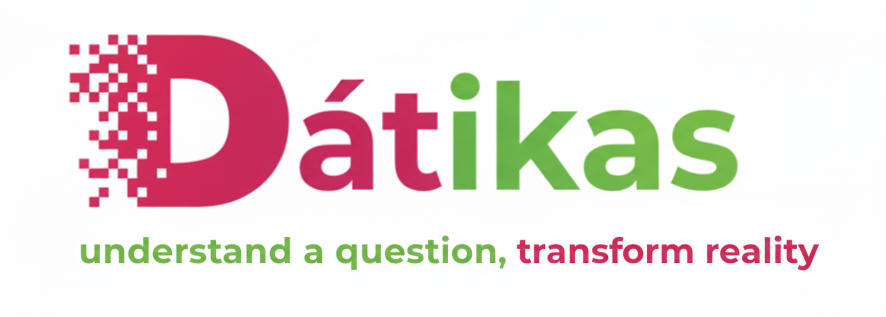

# Proyecto Dátikas


Los Baby Boomers alcanzaron la edad de compra en el momento de mayor expansión de propiedad en Estados Unidos, con tasas promedio cercanas al 67%. En contraste, los Millennials enfrentaron tasas más bajas y precios más altos, reflejando una caída en la accesibilidad habitacional. 

Este proyecto nos ayudará a entender esta fotografía de la realidad habitacional de Estados Unidos, donde los Baby Boomers enfrentaron precios más bajos, su acceso fue favorecido por políticas de expansión urbana y crédito. Los Millennials, en cambio, enfrentaron precios más altos y menor tasa de propiedad, reflejando una crisis de accesibilidad habitacional actual.

---

## 🔎 Fase 1: Selección del data set de estudio

En esta fase nos enfrentamos el reto de seleccionar un data set que contenga datos reales y censos de la población de Estado Unidos que nos proporcionara información demográfica por generaciones para poder realizar las comparativas en los datos. El siguiente reto fue conseguir data set que nos enriquecieran esta información y nos ampliaran los datos que obtuvimos en el data set de base.

---

## 🧹 Fase 2: EDA y limpieza de datos del data set

En esta fase se realizó un EDA usando Python para unificar datos, borrar columnas que no aportaban información relevante y unificar categorías.

---

## 📈 Fase 3: Selección de visualizaciones que cuenten la historia

En esta fase trabajamos en paralelo la construcción del storytelling con la selección de gráficas, para seleccionar las visualizaciones usando PowerBI. Con esta herramientas pudimos distribuir los datos que nos ayudan a contar la historia y comprobar nuestras hipótesis. 

---

## 🧽 Fase 4: Formateado de dashboard y presentación

En esta fase final nos dedicamos a pulir el formato general de la presentacion para unificar las visualziaciones, formatos, paleta de colores y hacerlo más atractivo, iterativo y fácil de entender.

---

## 👩‍💻 Tecnologías utilizadas


---

## 📁 Estructura del repositorio

```
project-da-promo-54-modulo-4-team-1/
│
├── README.md                     # Documentación principal del proyecto
│
├── .gitignore                    # Archivo de exclusión para Git
│
├── Dashboard.pbix                # Dashboard interactivo generado en Power BI             
│     
│
├── images/                       # Imágenes utilizadas en el dashboard y presentación
│   ├── casa_ant.png
│   ├── casa_hoy.PNG
│   ├── Inicio.png
│   ├── educacion_ingresos.png
│   ├── gen_blue.png
│   ├── laboral_blue.png
│   ├── logo.png
│   ├── ocup_blue.png
│   ├── wordcloud_blue.png        # Nube de palabras generada en Python
│   └── wordcloud_green.png       # Nube de palabras alternativa
│
├── notebook/                     # Notebooks de análisis exploratorio y visualización
│   ├── EDA_dataset.ipynb         # Análisis exploratorio de datos
│   └── Visualizaciones.ipynb     # Generación de gráficos y nubes de palabras
│
└──  resources/                    # Datos brutos y limpios utilizados
    ├── adult.csv                 # Dataset original (adult)
    ├── adult_limpio.csv          # Dataset limpio y preparado
    ├── EMSI_MillenialsvsBabyBoomers.xlsx  # Fuente adicional de ingresos por generación
    ├── generaciones.csv
    ├── home-ownership-by-country-2025.csv
    ├── household_income.csv
    ├── ingresos_generacionales_usa_2025.csv
    ├── median_income_by_year.csv
    ├── ownership_house.csv
    ├── precio_vivienda_usa_1940_2024.csv
    ├── world_population.csv
    └── world_population_total.csv
```
---

## 📝 Intrucciones de uso

Este proyecto requiere Python 3.8 o superior y PowerBI desktop.

1. Clonar el repositorio:

- git clone https://github.com/juliabeco/project-da-promo-54-modulo-4-team-1.git
- cd .\notebook\src\

2. Ejecutar el codigo para realizar la limpieza del CSV

3. Abrir el archivo de PowerBI  ['Dashboard']('Dashboard.pbix') para interactuar con las visualizaciones.

---

## ✅ Status del proyecto

✅ Finalizado

---

## 📷 Algunas visualizaciones del dashboard 


- Ejemplo 1:


- Ejemplo 2:
  


---

## ✍️ Autoras

- [Alejandra Martin - Equipo desarrolador](https://github.com/al3msvll)
- [Esther Domínguez - Equipo desarrolador](https://github.com/EstherDE135)
- [Iris Barredo del Sol - Scrum Master y Equipo desarrolador](https://github.com/irisbdelsol)
- [Julia Becaria Coquet - Equipo desarrolador](https://github.com/juliabeco)
- [Mar Pastor - Equipo desarrolador](https://github.com/MarPastor)

---
